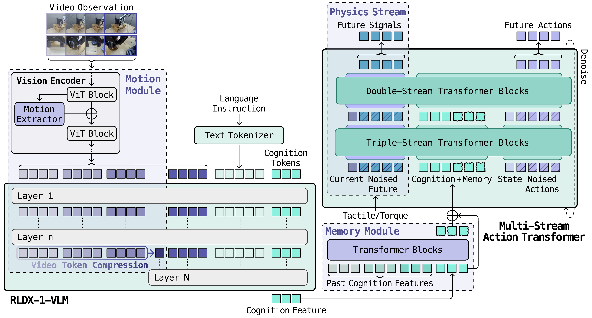

<div align="center">

# RLDX-1

[[Paper]](https://arxiv.org/abs/2605.03269) [[Project Page]](https://rlwrld.ai/rldx-1) [[Models]](https://huggingface.co/collections/RLWRLD/rldx-1)


</div>

---

RLDX-1 is a Vision-Language-Action model (VLA) for human-like
dexterous manipulation. Beyond the *versatile intelligence* inherited
from pre-trained VLM backbones, RLDX-1 adds three **functional
capabilities** — motion awareness, long-term memory, and physical
sensing — through a unified **Multi-Stream Action Transformer (MSAT)**
architecture, a synthetic-augmented training pipeline, and a real-time
inference stack.

---

<div align="center">

</div>

## Highlights

- **Multi-Stream Action Transformer (MSAT).** Cognition, physics, and
  action each get a dedicated stream coupled by joint self-attention —
  an extension of MM-DiT to action modeling.
- **Motion awareness.** Multi-frame observations + a motion module
  capture temporal dynamics; intermediate VLM layers compress video
  tokens to keep the policy efficient.
- **Long-term memory.** A memory module fuses past cognition features
  with the current ones for history-grounded decisions beyond a short
  multi-frame window.
- **Physical sensing.** Tactile and torque enter as a dedicated physics
  stream; the decoder is jointly trained to predict future physical
  signals.
- **Three-stage training.** Pre-training (generalization) → mid-training
  (functionality) → post-training (task adaptation), with synthetic data
  augmenting rare manipulation scenarios.
- **Real-time inference.** Static graph capture + custom fused kernels
  bring the all-modality model to **43.7 ms / step on RTX 5090
  (1.63× speedup, >22 Hz)**.

---

## Performance

### Simulation Benchmarks

Success rates (%) of RLDX-1 fine-tuned on each benchmark's training set,
compared to recent frontier VLA baselines.

| Method | LIBERO (Avg) | LIBERO-Plus | SIMPLER Google-VM | SIMPLER Google-VA | SIMPLER WidowX | RoboCasa Kitchen | GR-1 Tabletop | RoboCasa365 (Avg) |
|---|---|---|---|---|---|---|---|---|
| π0-FAST | 85.5 | 64.2 | 61.9 | 59.0 | 48.3 | 63.6 | — | 21.7 |
| π0      | 94.1 | 54.6 | 58.8 | 54.8 | 27.1 | 62.5 | 13.6 | 14.8 |
| π0.5    | 96.9 | 86.5 | 72.7 | 68.4 | 46.9 | 62.1 | 15.4 | 16.9 |
| GR00T N1.5 | 86.5 | 66.3 | 52.4 | 43.7 | 62.0 | 65.7 | 48.0 | 20.0 |
| GR00T N1.6 | 96.7 | 72.6 | 76.1 | 57.1 | 57.1 | 66.2 | 47.6 | 26.9 |
| **RLDX-1 (ours)** | **97.8** | **86.7** | **81.5** | **77.4** | **71.9** | **70.6** | **58.7** | **32.1** |

The first five columns cover the established LIBERO / SIMPLER family;
the last three (RoboCasa Kitchen, GR-1 Tabletop, RoboCasa365) are
long-horizon, humanoid, and compositional benchmarks. Per-benchmark
checkpoints, embodiment tags, and reproduce commands are listed under
[Reproducing Benchmark Results](#reproducing-benchmark-results).

---

## Installation

**Requirements**: Python 3.10, CUDA 12.x, [uv](https://github.com/astral-sh/uv) v0.8.4+

```bash
git clone https://github.com/RLWRLD/RLDX-1.git
cd RLDX-1
uv sync --python 3.10
uv pip install -e .
```

Verify installation:
```bash
uv run python -c "import rldx; print(rldx.__version__)"
```

For simulator setup, dev tooling, and full troubleshooting, see
[`docs/installation.md`](docs/installation.md).

---

## Documentation

Hands-on guides live under [`docs/`](docs/):

| Guide | What it covers |
|---|---|
| [`installation.md`](docs/installation.md) | Environment setup, simulator venvs, dev tooling, common pitfalls |
| [`architecture.md`](docs/architecture.md) | Five-stage walkthrough of the RLDX-1 model and its config flags |
| [`training.md`](docs/training.md) | `launch_train.py` recipes (fine-tune / mid-train), LoRA, training-time RTC, dataset layout |
| [`embodiment_tags.md`](docs/embodiment_tags.md) | What `EmbodimentTag` is and how to pick one for a custom robot |
| [`evaluation.md`](docs/evaluation.md) | RoboCasa / LIBERO / SIMPLER / GR-1 eval, server + rollout split, results aggregation |
| [`inference_server.md`](docs/inference_server.md) | `run_rldx_server.py` CLI, wire protocol, RTC modes, `--compile` levels, simulator + real-robot deployment |


---

## Pretrained & Midtrained Checkpoints

| Checkpoint | Description | Params | HuggingFace |
|-----------|-------------|--------|-------------|
| `RLDX-1-PT` | Pre-trained (video) | 6.9B | [RLWRLD/RLDX-1-PT](https://huggingface.co/RLWRLD/RLDX-1-PT) |
| `RLDX-1-MT-DROID` | Mid-trained on DROID with all add-ons | 8.1B | [RLWRLD/RLDX-1-MT-DROID](https://huggingface.co/RLWRLD/RLDX-1-MT-DROID) |
| `RLDX-1-MT-ALLEX` | Mid-trained on ALLEX with all add-ons | 8.1B | [RLWRLD/RLDX-1-MT-ALLEX](https://huggingface.co/RLWRLD/RLDX-1-MT-ALLEX) |

---

## Data Preparation

RLDX-1 uses [LeRobot](https://github.com/huggingface/lerobot) v2.1 format datasets. To convert your data:

```bash
# Convert a single dataset
bash run_scripts/data/convert_lerobot_single.sh /path/to/your/data

# Convert multiple datasets
bash run_scripts/data/convert_lerobot_multiple.sh /path/to/data/root
```

Each dataset must carry a `meta/modality.json` that slices the flat
state / action vectors into named joint groups and remaps video columns
to modality keys. Schema and a worked example are in
[`docs/training.md`](docs/training.md#dataset-layout-metamodalityjson).

### Custom Embodiment Config

Define your robot's modality configuration:

```python
# my_modality_config.py
from rldx.data.types import ModalityConfig

MODALITY_CONFIGS = {
    "my_robot": {
        "image": ModalityConfig(...),
        "state": ModalityConfig(...),
        "action": ModalityConfig(...),
    }
}
```

Pass it via `--modality-config-path my_modality_config.py` during training,
together with an `EmbodimentTag` that selects the per-robot MLP head slot
(default: `GENERAL_EMBODIMENT`; see
[`docs/embodiment_tags.md`](docs/embodiment_tags.md) for the picker).

The `EmbodimentTag` design and per-embodiment MLP head structure follow
the convention introduced by [NVIDIA GR00T N1.7](https://github.com/NVIDIA/Isaac-GR00T/tree/n1.7-release).

---

## Fine-tuning

This section covers how to fine-tune RLDX-1 from a pre-trained checkpoint
(`RLWRLD/RLDX-1-PT`) on your own LeRobot v2.1 dataset. The training entry
point is a single CLI (`rldx/experiment/launch_train.py`) where flags
toggle the optional functional capabilities described in
[Highlights](#highlights):

- `--video-length N` — temporal frames per observation (motion awareness)
- `--use-memory` — temporal memory module (long-term memory)
- `--use-motion` — motion module inside the VLM backbone
- `--use-physics --physics-keys ...` — tactile / torque streams (physical sensing)

LoRA, training-time RTC, and the full flag list are documented in
[`docs/training.md`](docs/training.md). Below are the canonical recipes.

### Single dataset, no add-ons

```bash
uv run python rldx/experiment/launch_train.py \
    --base-model-path RLWRLD/RLDX-1-PT \
    --dataset-path /path/to/your/dataset \
    --embodiment-tag GENERAL_EMBODIMENT \
    --video-length 4 \
    --n-cog-tokens 64 \
    --global-batch-size 64 \
    --learning-rate 1e-4 \
    --max-steps 60000 \
    --save-steps 5000 \
    --output-dir ./outputs/my_finetune
```

### With all add-ons (memory + motion + physics)

Recommended for embodiments where memory, motion awareness, or contact
sensing matter. To enable a *single* add-on instead of all three, keep
just the corresponding `--use-*` flag(s) and drop the rest.

```bash
uv run python rldx/experiment/launch_train.py \
    --base-model-path RLWRLD/RLDX-1-PT \
    --dataset-path /path/to/your/dataset \
    --embodiment-tag GENERAL_EMBODIMENT \
    --video-length 4 \
    --use-memory --memory-length 4 --concat-memory \
    --use-motion --motion-insert-layer 9 \
    --use-physics --physics-keys tactile torque --physics-dims 30 7 \
    --new-param-warmup-steps 2000 \
    --n-cog-tokens 64 \
    --global-batch-size 64 \
    --max-steps 60000 \
    --output-dir ./outputs/my_finetune_all
```

### Key Training Flags

| Flag | Description | Default |
|------|-------------|---------|
| `--video-length` | Number of video frames (video token compression is always on; set to `1` for single-frame) | `4` |
| `--video-stride` | Stride between frames in action-step units | `2` |
| `--use-memory` | Enable temporal memory module | `False` |
| `--memory-length` | Memory context window (timesteps) | `4` |
| `--use-motion` | Enable motion module | `False` |
| `--use-physics` | Enable physics signal conditioning | `False` |
| `--n-cog-tokens` | Number of cognition tokens | `64` |
| `--global-batch-size` | Total batch size across GPUs | `64` |
| `--new-param-warmup-steps` | Warmup steps for newly added modules | `0` |

### LoRA fine-tuning

For memory-constrained fine-tunes you can replace full-parameter tuning
of the action model (MSAT) and/or the backbone VLM with PEFT
LoRA adapters:

```bash
--action-model-use-lora --action-model-lora-rank 16 --action-model-lora-alpha 32
--backbone-use-lora --backbone-lora-rank 16 --backbone-lora-alpha 32 --backbone-lora-num-layers -1
```

`--action-model-use-lora` overrides `--tune-diffusion-model`;
`--backbone-use-lora` overrides `--tune-top-llm-layers`. Full flag list
and target-module defaults are in
[`docs/training.md`](docs/training.md#lora-fine-tuning).

### Training-time Real-Time Chunking

If you intend to serve the checkpoint with `--rtc-inference-mode trained`
(faster, fullgraph-compatible), enable training-time RTC at training
time:

```bash
--rtc-training-max-delay 4
```

The training-time RTC formulation follows
[Black et al. (Training-Time Action Conditioning for Efficient Real-Time Chunking)](https://arxiv.org/abs/2512.05964); the inference-side
counterpart is
[Black et al. (Real-Time Execution of Action Chunking Flow Policies)](https://arxiv.org/abs/2506.07339). See
[`docs/training.md`](docs/training.md#real-time-chunking-training-time)
and [`docs/inference_server.md`](docs/inference_server.md#real-time-chunking-rtc)
for usage details.

---

## Inference

RLDX-1 ships two inference paths sharing the same model + processor:

- **In-process** — load `RLDXPolicy` and call `get_action(obs)` directly
  from Python. Best for evaluation scripts and notebook prototyping.
- **ZeroMQ server** — `rldx/eval/run_rldx_server.py` for real-robot
  deployment, with two orthogonal optimizations layered on top of the
  base path:
    - *Graph capture + kernel fusion* (`--compile {submodule, fullgraph}`)
      — static-graph CUDA-graph capture and custom fused operators bring
      the all-modality model to **43.7 ms / step on RTX 5090** (1.63×
      speedup over PyTorch eager, >22 Hz).
    - *Real-Time Chunking* (`--rtc-inference-mode {guided, trained}`)
      — chunk-boundary stitching for smooth action handoff between
      consecutive chunks.

### Quick Start

```python
import torch
from rldx.policy.rldx_policy import RLDXPolicy
from rldx.data.embodiment_tags import EmbodimentTag

policy = RLDXPolicy(
    model_path="RLWRLD/RLDX-1-FT-ROBOCASA",
    embodiment_tag=EmbodimentTag.GENERAL_EMBODIMENT,
    device="cuda:0",
)

# Single-step inference
action = policy.get_action(observation)
```

### Serving (ZeroMQ)

For real-time robot deployment:

```bash
# Start the policy server
uv run python rldx/eval/run_rldx_server.py \
    --model-path RLWRLD/RLDX-1-FT-ROBOCASA \
    --embodiment-tag GENERAL_EMBODIMENT \
    --host 0.0.0.0 --port 20000
```

### Real-time inference (graph capture + RTC)

The server brings the all-modality model to **43.7 ms / step on RTX
5090 (1.63× speedup, >22 Hz)** through two orthogonal knobs:

**`--compile {none, submodule, fullgraph}`** — graph capture + kernel fusion.

- `submodule` — compiles each learnable sub-module. Preserves autograd. ~30 s warmup.
- `fullgraph` — CUDA-graph capture and operator fusion over the full VLA forward. Lowest steady-state latency, ~90–210 s warmup.
  - Tuned for RTX 5090 (Blackwell, sm_120). On other GPU architectures use `--compile submodule` for the intended result.

**`--rtc-inference-mode {none, guided, trained}`** — Real-Time Chunking for chunk-boundary stitching.

- `guided` — works with any flow-matching checkpoint.
- `trained` — requires a checkpoint trained with `--rtc-training-max-delay > 0`. Pairs with `--compile fullgraph`.
- Implementation follows [Black et al. (Real-Time Execution of Action Chunking Flow Policies)](https://arxiv.org/abs/2506.07339). The `trained` mode uses the integration from [Black et al. (Training-Time Action Conditioning for Efficient Real-Time Chunking)](https://arxiv.org/abs/2512.05964).

The full flag list, the `compile × RTC` compatibility matrix, and a
walkthrough of the trade-offs are in
[`docs/inference_server.md`](docs/inference_server.md#real-time-chunking-rtc).

---

## Reproducing Benchmark Results

Each benchmark has a self-contained eval README; this table maps each
result row in [Performance](#simulation-benchmarks) to the fine-tuned
checkpoint we used, the embodiment tag the server expects, and the
runnable guide.

| Benchmark | Fine-tuned Checkpoint | Embodiment Tag | Eval Guide |
|---|---|---|---|
| LIBERO | [RLWRLD/RLDX-1-FT-LIBERO](https://huggingface.co/RLWRLD/RLDX-1-FT-LIBERO) | `GENERAL_EMBODIMENT` | [`run_scripts/eval/libero/README.md`](run_scripts/eval/libero/README.md) |
| LIBERO-Plus | [RLWRLD/RLDX-1-FT-LIBERO](https://huggingface.co/RLWRLD/RLDX-1-FT-LIBERO) | `GENERAL_EMBODIMENT` | [`run_scripts/eval/libero_plus/README.md`](run_scripts/eval/libero_plus/README.md) |
| SimplerEnv Google | [RLWRLD/RLDX-1-FT-SIMPLER-GOOGLE](https://huggingface.co/RLWRLD/RLDX-1-FT-SIMPLER-GOOGLE) | `OXE_FRACTAL` | [`run_scripts/eval/simpler/README.md`](run_scripts/eval/simpler/README.md) |
| SimplerEnv WidowX | [RLWRLD/RLDX-1-FT-SIMPLER-WIDOWX](https://huggingface.co/RLWRLD/RLDX-1-FT-SIMPLER-WIDOWX) | `OXE_BRIDGE_ORIG` | [`run_scripts/eval/simpler/README.md`](run_scripts/eval/simpler/README.md) |
| GR-1 Tabletop | [RLWRLD/RLDX-1-FT-GR1](https://huggingface.co/RLWRLD/RLDX-1-FT-GR1) | `GENERAL_EMBODIMENT` | [`run_scripts/eval/gr1_tabletop/README.md`](run_scripts/eval/gr1_tabletop/README.md) |
| RoboCasa Kitchen (24 tasks) | [RLWRLD/RLDX-1-FT-ROBOCASA](https://huggingface.co/RLWRLD/RLDX-1-FT-ROBOCASA) | `GENERAL_EMBODIMENT` | [`run_scripts/eval/robocasa_kitchen/README.md`](run_scripts/eval/robocasa_kitchen/README.md) |
| RoboCasa365 | [RLWRLD/RLDX-1-FT-RC365](https://huggingface.co/RLWRLD/RLDX-1-FT-RC365) | `GENERAL_EMBODIMENT` | [`run_scripts/eval/robocasa_365/README.md`](run_scripts/eval/robocasa_365/README.md) |

Shared mechanics (server + rollout split, common flags, troubleshooting)
are documented in [`docs/evaluation.md`](docs/evaluation.md).

---

## Project Structure

```
rldx/
├── configs/                              # Model, data, and training configurations
├── data/                                 # Dataset loaders, processors, and statistics
├── experiment/                           # Training entry points and utilities
├── eval/                                 # Evaluation scripts and sim environments
├── inference/                            # Inference engine: GraphSafe substrate, fused Triton kernels, RTC dispatch
├── model/
│   ├── core/                             # Core model (RLDX-1, processor, setup)
│   ├── modules/
│   │   ├── backbone/                     # RLDX-1-VLM backbone (with video token compression)
│   │   ├── action_model/                 # MSAT diffusion action model + physics head
│   │   ├── memory.py                     # Temporal memory transformer
│   │   ├── norms.py                      # Shared normalization primitives
│   │   └── embodiment_conditioned_mlp.py
│   ├── pipeline.py                       # Training/inference pipeline glue
│   └── registry.py                       # Embodiment + variant registry
├── policy/                               # Inference policy wrappers
└── utils/                                # Distributed training utilities
```

---

## Citation

```bibtex
@article{rldx2026,
  title={RLDX-1 Technical Report},
  author={Dongyoung Kim and Huiwon Jang and Myungkyu Koo and Suhyeok Jang and Taeyoung Kim and others},
  year={2026},
  journal={arXiv preprint arXiv:2605.03269},
  eprint={2605.03269},
  archivePrefix={arXiv}
}
```

---

## Acknowledgments

RLDX-1 builds upon the following open-source projects:

- [NVIDIA GR00T N1.7](https://github.com/NVIDIA/Isaac-GR00T/tree/n1.7-release) — Training Codebase
- [Qwen3-VL](https://github.com/QwenLM/Qwen3-VL) — Vision-language backbone
- [FLUX](https://github.com/black-forest-labs/flux) — MMDiT architecture

## License

- **Code**: released under the [Apache License 2.0](LICENSE.md). The codebase
  is built on the [NVIDIA Isaac GR00T N1.7](https://github.com/NVIDIA/Isaac-GR00T/tree/n1.7-release)
  framework — third-party attributions and per-file provenance headers are
  preserved in the source tree.
- **Model weights**: distributed on Hugging Face under the
  [RLWRLD Model License v1.0](https://huggingface.co/RLWRLD/RLDX-1-PT/blob/main/LICENSE.md)
  (a non-commercial license with attribution and share-alike terms). By using
  any `RLWRLD/RLDX-1-*` checkpoint you agree to those terms.

## Contributions

We currently do not accept external pull requests on this repository.
If you encounter a bug, broken reproduction step, or have a question
about RLDX-1, please **open an issue** at
[github.com/RLWRLD/RLDX-1/issues](https://github.com/RLWRLD/RLDX-1/issues)
and we will follow up there.
